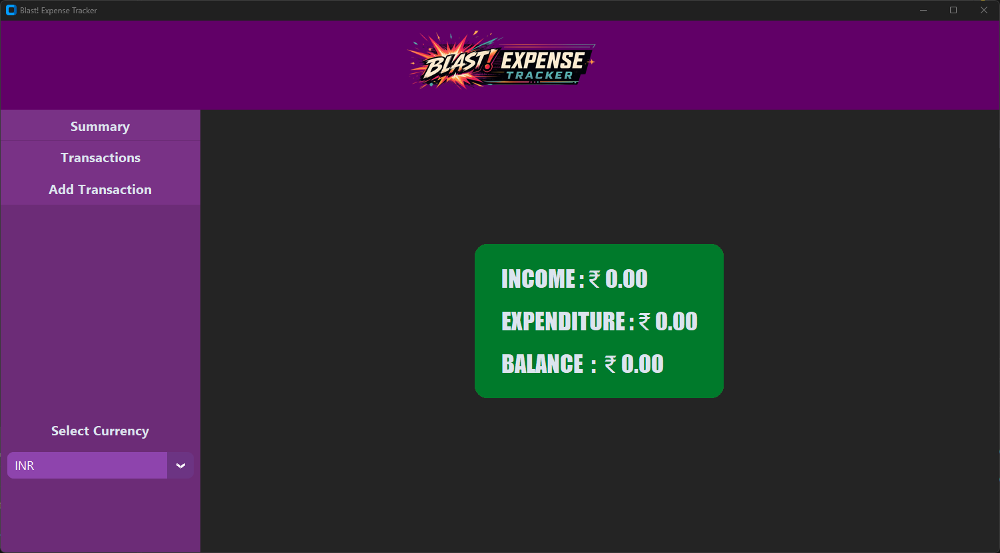
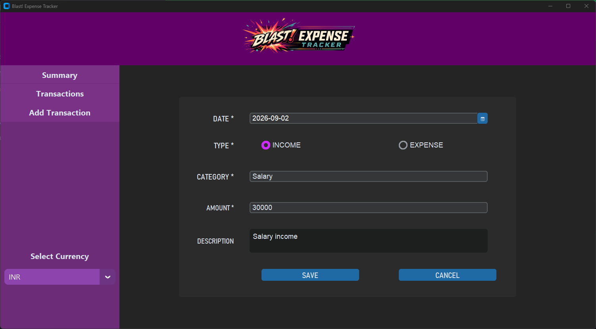
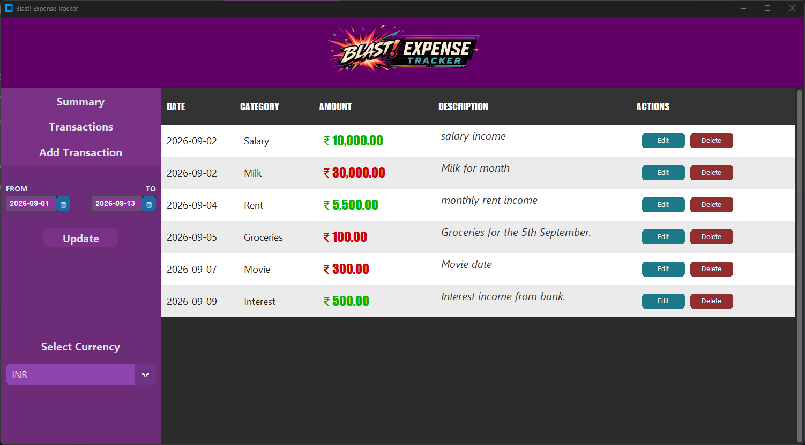
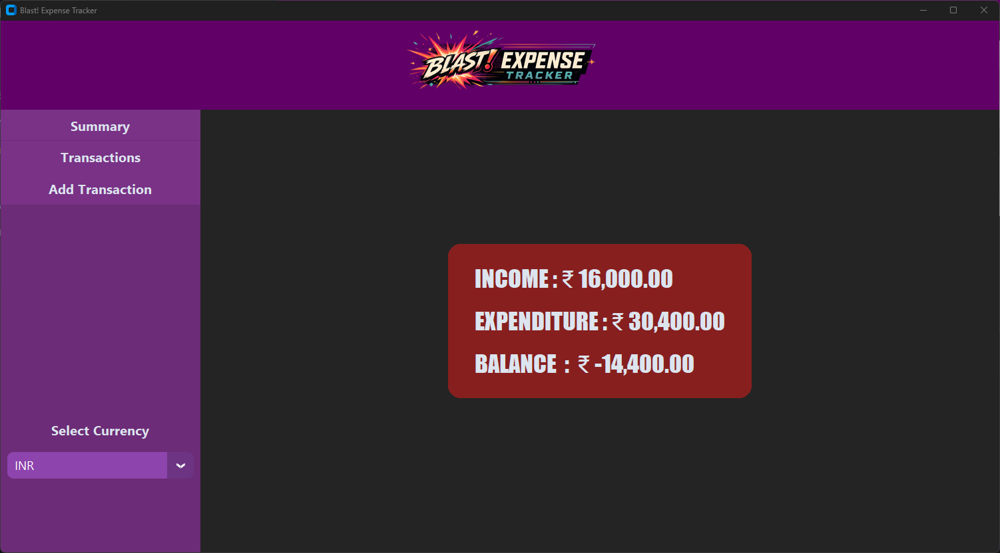
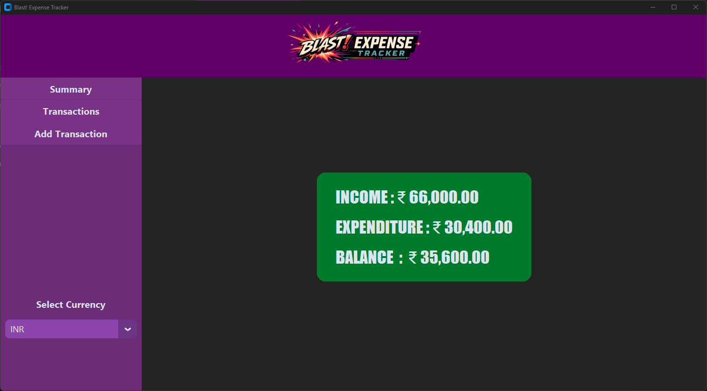

# BLAST! EXPENSE TRACKER

#### Video Demo:  <URL HERE>

## Description

Blast! Expense Tracker is my CS50 Python project. It's an expense tracker app that uses "Custom TKinter" for the interface. The application uses two primary files, "etracker.py" and "expenseDB.py" to implement 3 classes, "ExpenseTracker", "TransForm" and "Expenses" to build its functionalities. 

The expense tracker helps a user add any expense or income from any date and by default shows a summary of the month. It shows the list of transactions and gives the ability to filter transactions by start and end dates. It also has "Edit" and "Delete" functions for each transaction. Users can add new transactions and edit existing ones from the transaction form. The tracker also gives the ability to change the  currency symbol (no currency conversion).

By default it shows current month's transactions in the transaction list, but users can change dates to see oa larger list.

# Architecture

he expense tracker uses 3 classes:

- **ExpenseTracker**: This class is the primary application that creates the expense tracker, along with the database functions.
- **Expenses**: This class auto-creates the SQLite3 database required.
- **Trans_Form**: This class creates a transaction form with fields such as date, type, amount, category, and description and allows users to add transactions to the database.

### Functions

There are many functions that were implemented as part of the tracker. Some of the important ones are listed below.

#### ExpenseTracker class

- **build_ui()**: This function helps build the user interface of the tracker, it uses “Custom TKinter” which is Python’s GUI building library to build multiple frames to display list of expenses, the transaction form, sidebar, topbar with logo, etc. Build_sidebar(), build_summary(), etc., are called from within here to display those items.
- **build_summary()**: This functions builds a monthly summary of expenses/income and shows the balance. It has green/red background based on whether the balance is positive or negative for the month.
- **build_expense_table()**: This function generates an expense table with data it gets from the database. By default it shows the details of the current month’s transactions. But users are given date pickers to select a wider range of dates.
- **change_currency()**: This function allows users to set a different currency symbol. It doesn’t have conversion options, only symbol change. Currency conversion is not a feature of the app.

#### Trans_Form class

- **build_form_ui()**: This function builds the UI of the form. The Trans_Form class is a subclass of CTkFrame, so it can be displayed on any GUI element. The form UI has fields for date, type, category, amount, and description. It also has two buttons to save or cancel the transaction.
- **validate_form()**: This function validates all the data the user puts in the fields. If any data is missing or incorrect, it alerts users using an alert box, implemented using CTkMessagebox class.
- **save_trans()**: This function calls the database’s function to add a validated transaction to the database.
- **cancel_trans()**: The function resets the transaction box and cancels the transaction.
- **reset_form()**: Removes all data from the form fields and resets it back to default setting. Called by default after a transaction is saved or cancelled.
- **edit_trans()**: The function is called when “Edit” button on transaction table is clicked. It populates all the details of the transaction in the same form, and allows users to make edits.

#### Expenses class

- **\__init__()**: The init function of Expenses generates a database within a path specified by self.db_path.

- **create_table()**: The function is used to create required database tables. Two tables are auto-created: "transactions" and "options". The transactions table contains all the transactions submitted by the user.  The options table currently contains only the currency as set by the user. Default when initialized is INR.

- **get_currency() and set_currency()**: These functions as their names suggest allow user to get the current currency symbol and change the symbol.

- **data_generator()**: The function executes an SQLite command to generate the data, by default, of the current month. If different dates are supplied by the user, it generates the data of that period.

- **get_transaction()**: The function allows the app to get a specific transaction, by searching by its id.

- **save_transaction()**: The function helps save a transaction submitted by the user. Transaction data is supplied as a tuple with 5 fields for date, type (income/expense), category, amount, and description.

- **update_transaction()**: The function allows user to update any transaction, by searching it with its id. The transaction is first fetched using *get_transaction* and populated to the form on the app. After user updates details and clicks save, the transaction is updated on the database.

- **del_transaction()**: Allows users to click the *delete* button and delete the specific transaction.

- **summary_generator()**: This function returns a summary of the month. Returns a dictionary with income, expense, and balance for the month. It can be used to generate summary for different periods by supplying different dates (although that functionality is not implemented in the interface).

### Libraries used

#### GUI library (Custom TKinter)

The app uses GUI generated with *customtkinter* Python library, which allows creation of modern GUIs. In addition, we use *CTkDateEntry* for date picking fields and *CTkMessagebox* for message box. Most of the functionality are provided with CTkFrames, CTkLabels, CTkButtons, and CTk.StringVar variables.

#### PIL

The app uses a custom logo (created using Gen AI) and it's displayed on the top panel using PIL image library of Python.

#### SQLite3

The app uses *sqlite3* for the database. It's imported in *Expenses* class to create the database. The class encapsulated all required functions within the database. The Expenses class instance within the ExpenseTracker object is able to manipulate the data within the database directly from within the app.

## Screenshots

Here are a few screenshots from the app.

**Main Window**

**Add transaction form**

**Transaction list**

**Transaction summary**

